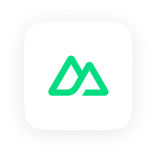
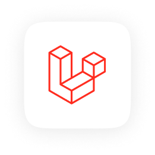
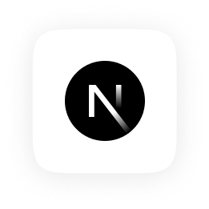
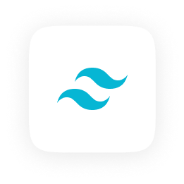
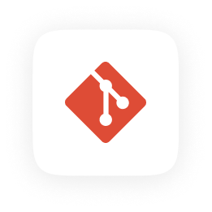

# Hi, i'm Matt - a Fullstack Developer

I've been learning Web Development for about 3 years now. 
The latest tech I've learned is PHP with Laravel. 
I am very interested in learning backend and the technologies mentioned above make it very enjoyable. 
My next step would be learning practical uses of testing and CI/CD. 
Here are some of my apps: 
- [Cosweats](https://github.com/trycmateusz/Cosweats) - an online clothing store (using Nuxt 3)
- [Xploric](https://github.com/trycmateusz/Xploric) - an app for saving and listening to music using Spotify API (WIP) (using Nuxt 3)
- [Magic the Gathering Deck Builder](https://github.com/trycmateusz/Magic-the-Gathering-deck-builder) - a deck builder for a popular card game franchise (using Next.js)
- [Terraria Block Palette Remastered](https://github.com/trycmateusz/Terraria-Block-Palette-Remastered) - an app for searching inspiration to build in the game Terraria (using Vue 3)

## Techstack

  
  
  
  
  
  
  
  
  
  
  
  
  
  

